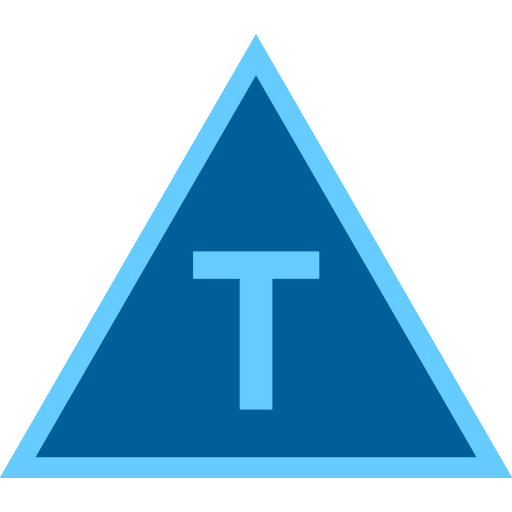
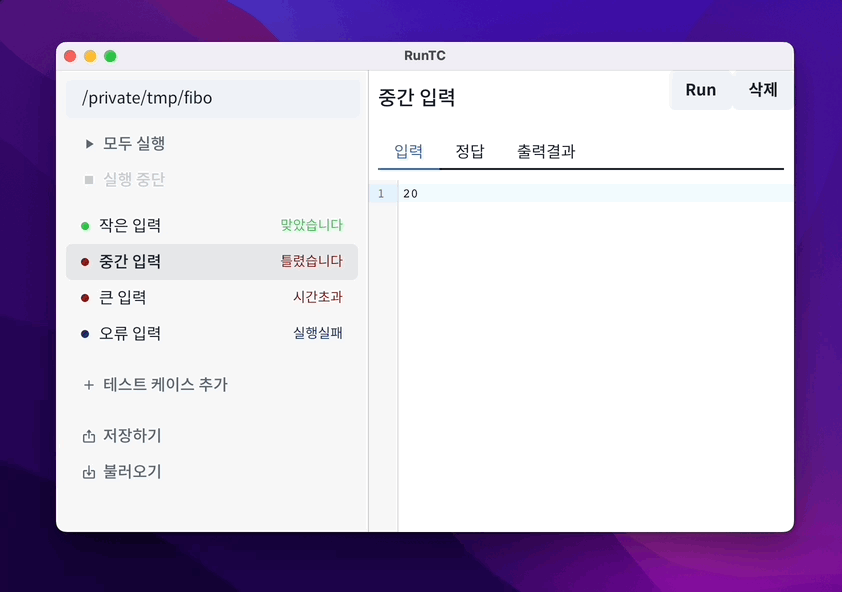

<div align="center">
    
    <h1>RunTC</h1>
    <p>알고리즘의 입력과 출력을 테스트해 보세요.</p>
    
</div>
<br>
<div align="center">
    <b><a href="https://github.com/Tekiter/RunTC/releases">다운로드</a></b>
</div>

## ⚙️ 직접 빌드하기

```bash
$ yarn install
$ yarn build --windows --mac --linux
```

빌드 결과는 `./release` 디렉터리에 저장됩니다.
